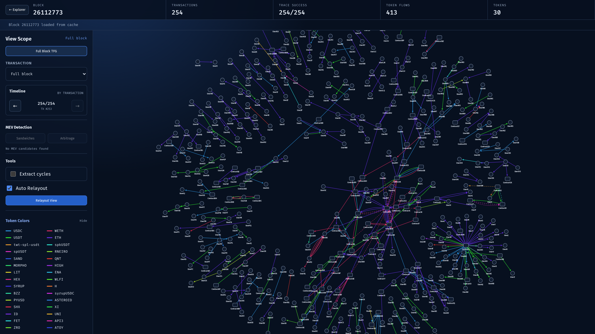

# WholeBlock MEV Explorer

WholeBlock MEV Explorer provides two levels of Ethereum analysis: fast, Event-based MEV labeling across recent blocks, followed by on-demand, opcode-level trace analysis and interactive token-flow visualization for a selected block. The fast-labeling layer is adapted from [Flashbots' `mev-inspect-py`](https://github.com/flashbots/mev-inspect-py).



## Requirements

- Python 3.12+
- [uv](https://docs.astral.sh/uv/)
- Node.js `^20.19.0` or `>=22.12.0`
- A Geth node with HTTP JSON-RPC and the `debug` API enabled
- RPC support for `eth_getBlockReceipts` and `debug_traceBlockByNumber`

The node must retain historical state for every block that you want to trace.

## Configuration

Copy the example environment file:

```bash
cp backend/.env.example backend/.env
```

Then edit `backend/.env`:

| Variable | Default | Description |
| --- | --- | --- |
| `GETH_API` | `http://127.0.0.1:8545` | Geth HTTP JSON-RPC endpoint |
| `TRACE_WORKERS` | `2` | Full-TFG trace concurrency, clamped to 1–8 |
| `MEV_POLL_SECONDS` | `3` | Chain-head polling interval in seconds |
| `MEV_HISTORY_BLOCKS` | `1800` | Startup tracking window, including the startup head |
| `CORS_ORIGINS` | Local frontend URLs | Comma-separated allowed browser origins |

`backend/.env` is ignored by Git. Never commit an authenticated RPC URL or other credentials.

## Local development

Start the backend:

```bash
cd backend
uv sync
uv run uvicorn server:app --host 0.0.0.0 --port 9021
```

In another terminal, start the frontend:

```bash
cd frontend
npm ci
npm run dev
```

Open <http://localhost:9020>. The Vite development server sends API requests to `http://127.0.0.1:9021`.

## Production build

```bash
cd frontend
npm ci
npm run build

cd ../backend
uv sync
uv run uvicorn server:app --host 0.0.0.0 --port 9021
```

When `frontend/dist/` exists, FastAPI serves the built frontend together with the API. Open <http://localhost:9021>.

## Command-line analysis

Analyze a block without opening the web interface:

```bash
cd backend
uv run python cli.py latest
uv run python cli.py 25976348 --force
```

Generated traces and graph files are written under the repository's `data/` directory.

## API

| Method | Path | Description |
| --- | --- | --- |
| `GET` | `/api/explorer?limit=180&before=...` | Read one page of block headers and fast MEV labels |
| `GET` | `/api/latest` | Read the current chain head |
| `POST` | `/api/analyze` | Submit a full-TFG analysis job |
| `GET` | `/api/jobs/{job_id}` | Read analysis progress |
| `GET` | `/api/blocks/{block_number}` | Read a generated block graph |

## Tests

From the repository root:

```bash
uv run --project backend --with pytest python -m pytest -q
```

## Project layout

```text
backend/       FastAPI API, trace analysis, and MEV scanner
frontend/      Vue 3, TypeScript, and Vite frontend
tests/         Python unit tests
data/          Generated local data; excluded from Git
```
